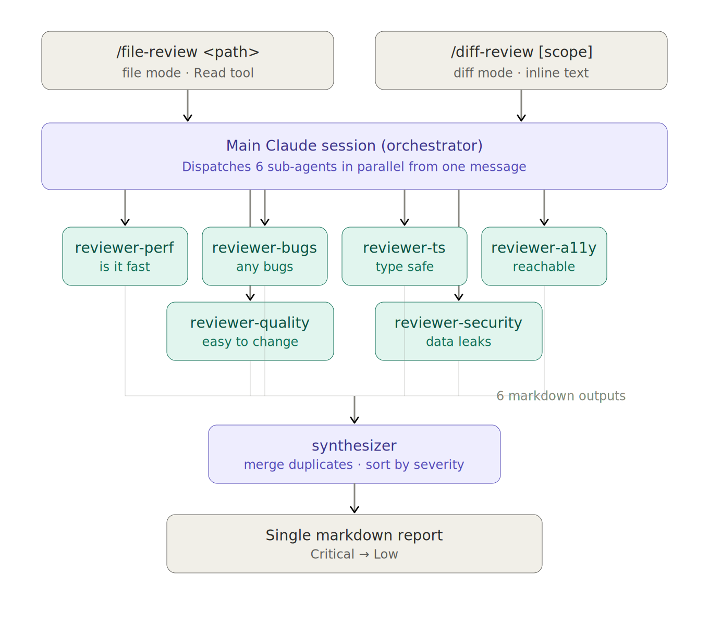

<p align="center">
  
</p>

<div align="center">

[](LICENSE)
[](#quick-start)

**6 specialized frontend reviewers, dispatched in parallel, each in an isolated context.**

[Quick Start](#quick-start) · [Reviewers](#reviewers) · [Why this design](#why-this-design) · [Architecture](#architecture) · [Adding a reviewer](docs/adding-a-reviewer.md)

[한국어](./README.md) · English

</div>

A **multi-reviewer code-review plugin** for Claude Code. It reviews a git diff or a single file from 6 perspectives (perf · code quality · bugs · types · a11y · security). Each perspective is a **reviewer**: a single-purpose agent with its own ruleset, dispatched in a single message alongside the others. A synthesizer agent merges the 6 outputs into one prioritized markdown report.

The default preset follows _well-known, established frontend guidelines_ directly. Add your own reviewer by creating an agent file and registering it in both slash commands.

## Key Features

- **Expert reviewers** — Vercel React Best Practices · Toss Frontend Fundamentals · Effective TypeScript · WCAG 2.2 · OWASP-style frontend security.
- **Single-message dispatch** — All 6 reviewers fire from one assistant message. The runtime decides whether they wall-clock-parallel or serialize; we don't promise wall time, but the orchestration is set up to maximize concurrency.
- **Isolated per-reviewer context** — Each reviewer reviews in its own sub-agent context. No cross-axis reasoning contamination, no mode collapse.
- **Two entry points** — `/fe-review-agents:diff-review [scope]` for git diff (PR review), `/fe-review-agents:file-review <path>` for a single file (deep dive on one component).
- **Markdown synthesis** — Reviewers emit one-line findings with stable `[axis/rule-id]` tags; synthesizer sorts by severity and produces a single readable report.
- **Bilingual** — `lang=ko` (default) or `lang=en`.
- **Simple setup** — One command (`npx fe-review-agents install`), one runtime dependency (Claude Code).

## Quick Start

### Install

```bash
# Project-level (this repo only)
npx fe-review-agents install

# Globally (all projects)
npx fe-review-agents install --global

# Preview without writing
npx fe-review-agents install --dry-run
```

Per-tool guide: [Claude Code](docs/install-claude-code.md).

### Use

Diff-based review (review what changed):

```
/fe-review-agents:diff-review                       # staged (default)
/fe-review-agents:diff-review unstaged
/fe-review-agents:diff-review branch:main
/fe-review-agents:diff-review range:HEAD~3..HEAD
/fe-review-agents:diff-review unstaged lang=en
```

Single-file review (deep dive):

```
/fe-review-agents:file-review src/components/Header.tsx
/fe-review-agents:file-review src/components/Header.tsx lang=en
```

Or in natural language:

```
Review my staged changes.
Audit src/components/Header.tsx for issues.
```

| Option  | Default  | Values                                                  | Applies to    |
| ------- | -------- | ------------------------------------------------------- | ------------- |
| `scope` | `staged` | `staged`, `unstaged`, `branch:<name>`, `range:<a>..<b>` | `diff-review` |
| `lang`  | `ko`     | `ko`, `en`                                              | both          |

Each reviewer can also be invoked standalone:

```
@reviewer-a11y
```

Or:

```
Just check this for accessibility issues.
```

## Reviewers

> _reviewer_ = a single-purpose agent. The 6 in the table are the default preset; add your own freely. Agent names follow the form `reviewer-<name>` (e.g. `reviewer-a11y`).

| Reviewer            | Source                                                                                                           | Asks                                            | What it catches                                                                                                               |
| ------------------- | ---------------------------------------------------------------------------------------------------------------- | ----------------------------------------------- | ----------------------------------------------------------------------------------------------------------------------------- |
| `reviewer-react-perf`     | [Vercel React Best Practices](https://github.com/vercel-labs/agent-skills/tree/main/skills/react-best-practices) | Is it fast?                                     | Waterfalls, RSC serialization bloat, bundle size, rendering anti-patterns                                                     |
| `reviewer-quality`  | [Toss Frontend Fundamentals](https://github.com/toss/frontend-fundamentals)                                      | Is it easy to change?                           | Readability, predictability, cohesion, coupling                                                                               |
| `reviewer-bugs`     | React rules-of-hooks + ESLint/TS-ESLint + JS/TS/HTML/CSS correctness rules                                       | Are there bugs?                                 | Stale closures, missing deps, hook order, race conditions, floating promises, empty catches, == coercion, missing button type |
| `reviewer-ts`       | Google TypeScript Style Guide + Effective TypeScript                                                             | Is the type system being worked with or around? | `any`, careless casts, `!` assertions, `@ts-ignore`, weak types, mutable exports                                              |
| `reviewer-a11y`     | WCAG 2.2 + ARIA APG                                                                                              | Can everyone reach it?                          | Missing alt, unnamed icon buttons, broken keyboard nav, ARIA misuse, focus indicator removal                                  |
| `reviewer-security` | Frontend security patterns (XSS, secret leakage, unsafe storage)                                                 | Is data leaking?                                | XSS, secret leakage, unsafe storage, dangerous JS APIs                                                                        |

## Why this design

### Why isn't one perspective enough?

Each guideline answers a _different question_ — perf asks _is it fast_, a11y asks _can everyone reach it_, security asks _is data leaking_. The perspectives barely overlap, so running just one will entirely miss the issues the others would catch. It's like taking the multiple viewpoints a senior reviewer simultaneously juggles in their head when looking at a PR, and lifting them directly into a tool.

### Why isolated sub-agents (instead of one model with one prompt)?

Telling one model "review this PR for perf, quality, a11y, security, types, and bugs at the same time" produces lower-quality output than dispatching each as a sub-agent with its own context. Two structural reasons:

1. **No reasoning contamination** — In a single context, the perf finding's framing colors the a11y finding's tone. Split into sub-agents, each reviewer does its job _without knowing_ what the others caught.
2. **No mode collapse** — One context "review for everything" tends to gravitate toward whichever axis is loudest in the diff. Physically separate contexts make that impossible.

By analogy: instead of asking one person to "review it from every angle," it's **a panel of specialist reviewers placed in isolated rooms with the same change in hand, gathered afterward to reconcile conflicts and overlap**.

### Single-message dispatch (parallel intent)

The slash commands instruct the main session to issue all 6 `Agent` tool_use blocks in one message. The runtime decides whether to run them concurrently or in sequence; we don't promise either way. **The architecture is set up to maximize concurrency where the runtime allows it.** The synthesizer step runs once after all 6 reviewers return.

### Two modes, same fan-out

- **`/fe-review-agents:diff-review`** is for PR-style review: collect the relevant diff (staged / unstaged / branch / range), filter to frontend files, fire the 6 reviewers on the diff text.
- **`/fe-review-agents:file-review`** is for single-file deep dives: each reviewer `Read`s the file directly. Useful when you want a fresh-eyes review of one component before opening a PR.

Both go through the same 6 reviewers and the same synthesizer.

## Architecture

<p align="center">
  
</p>

## How findings merge

Each reviewer emits one-line findings:

```markdown
### ⚡ Performance

- **[perf/server-fetch-in-effect]** [HIGH] Line 23: useEffect for initial data fetch — Move to a Server Component, pass via props.
```

The synthesizer collects all 6 reviewer outputs, sorts by severity (`CRITICAL` → `HIGH` → `MED` → `LOW`), and emits a single report. Multiple reviewers flagging the same line with different rule IDs both stay in the output — they're different perspectives. Identical rule IDs at the same line dedupe.

## Sample output

A single change can fire multiple reviewers on the same lines. Here's a hunk that hits three:

```diff
+ export default function Profile({ userId }) {
+   const [bio, setBio] = useState('');
+
+   useEffect(() => {
+     fetch('/api/user/' + userId, {
+       headers: { 'X-API-Key': 'sk_live_<YOUR_KEY>' },
+     })
+       .then(r => r.json())
+       .then(d => setBio(d.bio));
+   }, []);
+
+   return <div dangerouslySetInnerHTML={{ __html: bio }} />;
+ }
```

`/fe-review-agents:diff-review` returns a single prioritized report:

---

#### 🔍 Code Review: git diff (scope: staged)

##### At a glance

- **Total issues**: 4
- 🔴 CRITICAL: 2 | 🟠 HIGH: 2 | 🟡 MED: 0 | 🟢 LOW: 0

##### Priority issues (by severity)

###### 🔴 CRITICAL

- **[security/hardcoded-secret]** Line 6: API key (`sk_live_*`) committed in source — Move to a server-side env var; never ship to the client bundle.
- **[security/dangerously-set-inner-html]** Line 11: HTML from network response rendered raw — Sanitize server-side or render as text.

###### 🟠 HIGH

- **[perf/server-fetch-in-effect]** Line 4: useEffect for initial data fetch — Move to a Server Component, pass via props.
- **[bugs/effect-missing-dep]** Line 4: useEffect references `userId` but deps array is `[]` — Add `userId` to deps (and address perf issue first).

##### Summary

Two CRITICAL security issues need immediate attention — rotate the leaked API key and sanitize the HTML before rendering. The perf and bugs findings cluster at the same useEffect; fixing the perf issue (Server Component) will dissolve the missing-dep issue too.

---

One pass, three reviewers on the same line range. The reviewers don't see each other — the merge happens after they return.

## Adding a reviewer

If the default 6 don't cover a perspective you need (i18n, motion, dependency hygiene, design tokens, etc.), drop in `agents/reviewer-<name>.md` then register it in both slash commands' dispatch lists and synthesizer prompts.

Full guide: [docs/adding-a-reviewer.md](docs/adding-a-reviewer.md) — frontmatter contract, output format, rule-catalog format, boundary discipline (don't overlap with other reviewers), and a copy-paste-ready agent skeleton.

## License

MIT — see [LICENSE](./LICENSE).
