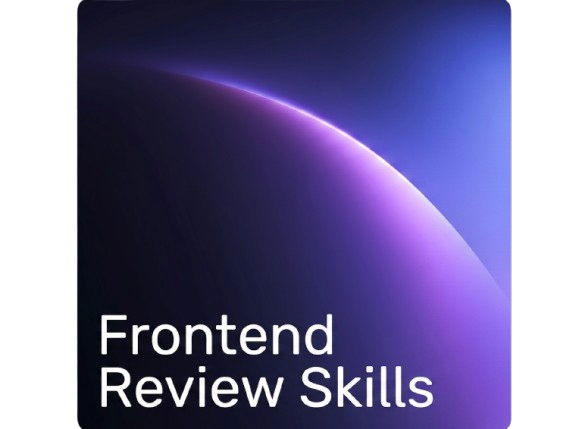
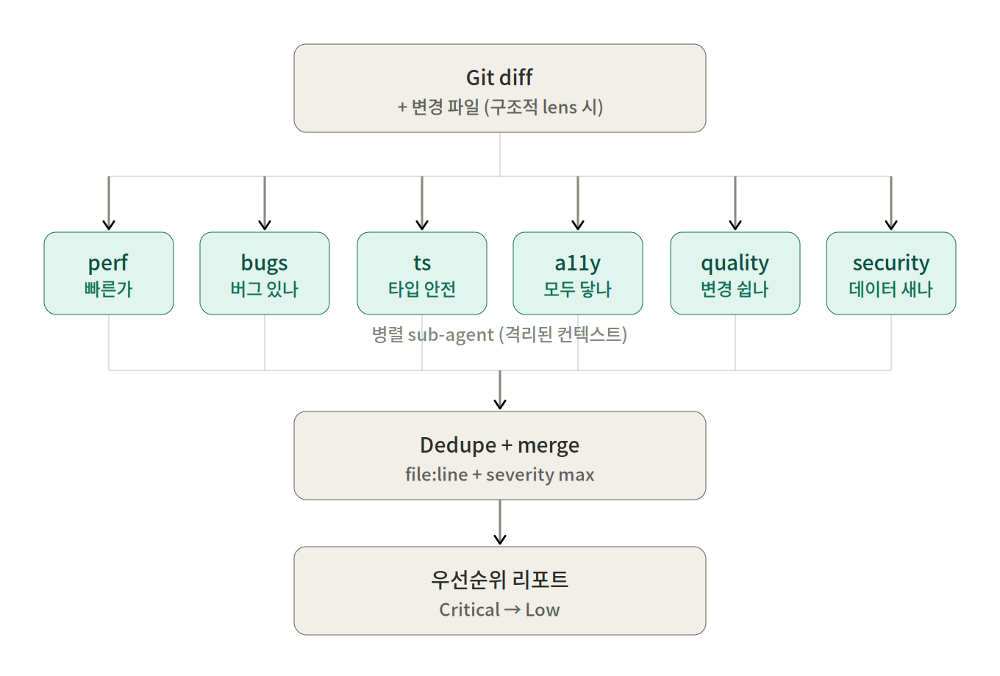

<p align="center">
  
</p>

<div align="center">

[](LICENSE)
[](#빠른-시작)

**6개의 프론트엔드 가이드라인이 각자 격리된 컨텍스트에서 diff를 검토합니다.**

[빠른 시작](#빠른-시작) · [렌즈](#렌즈) · [왜 이렇게 설계했나](#왜-이렇게-설계했나) · [아키텍처](#아키텍처) · [Lens 추가](docs/adding-a-lens.md)

[English](./README.md) · 한국어

</div>

AI 코딩 에이전트(Claude Code · Codex · Gemini CLI)용 **멀티 lens 코드 리뷰 플러그인**입니다. git diff 또는 변경 파일을 최대 6개 관점(perf · 코드 품질 · 버그 · 타입 · a11y · security)으로 리뷰합니다. 각 관점은 **lens**로 정의합니다 — 한 가지 일에만 집중하는 리뷰어가 자기만의 룰셋과 격리된 sub-agent 컨텍스트에서 실행됩니다. 결과는 우선순위가 매겨진 하나의 리포트로 합쳐집니다.

기본 프리셋은 _잘 알려진 공인된 프론트엔드 가이드라인_ 을 그대로 따릅니다. lens를 직접 추가하려면 agent 파일을 만들고 오케스트레이터의 roster에 등록하면 됩니다.

## 핵심 기능

- **전문 lens** — Vercel React Best Practices · Toss Frontend Fundamentals · Effective TypeScript · WCAG 2.2 · OWASP 등
- **lens별 격리 컨텍스트** — 각 lens가 자기만의 sub-agent 컨텍스트 윈도우에서 리뷰. 추론 오염도, 모드 콜랩스도 없음.
- **Triage** — 오케스트레이터가 diff를 먼저 보고 관련 있는 lens만 (보통 6개 중 2-3개) 실행. 모든 lens를 무조건 돌리는 것보다 시간·토큰 절약.
- **Smart input routing** — 라인 단위 룰엔 diff만, 구조적 룰엔 파일 전체. 비용은 _"전체 코드베이스 × N배"가 아니라 "diff × N배 + α"_ 로 유지
- **관점 보존 머지** — 같은 코드를 여러 lens가 잡으면 한 이슈에 모든 관점 나란히 보존
- **간편한 세팅** — 명령어 한 줄로 새 레포에서 즉시 시작 (Claude Code · Codex · Gemini CLI)
- **Wall time에 대한 정직** — sub-agent는 직렬로 실행됨 (Claude Code [Issue #3013](https://github.com/anthropics/claude-code/issues/3013); Codex/Gemini도 실제론 동일). 가치는 격리이지 병렬성이 아닙니다. [왜 이렇게 설계했나](#왜-이렇게-설계했나) 참고.

## 빠른 시작

### 설치

```bash
# Claude Code (primary — 플러그인: 오케스트레이터 skill + 6개 lens agent)
npx fe-review-skills install claude-code

# Codex CLI (review-orchestrator + 6 lens TOML agent)
npx fe-review-skills install codex-cli

# Gemini CLI (review-orchestrator + 6 lens markdown agent)
npx fe-review-skills install gemini-cli
```

옵션:

- `--global` — `~/<tool-dir>` 에 설치 (모든 프로젝트에서 사용)
- `--dry-run` — 실제 쓰기 없이 어디에 설치될지 미리보기

툴별 자세한 안내: [Claude Code](docs/install-claude-code.md) · [Codex](docs/install-codex-cli.md) · [Gemini CLI](docs/install-gemini-cli.md).

### 사용

설치 후, Claude Code에서 슬래시 또는 자연어로 호출:

```
/fe-review-skills:diff-review
```

또는:

```
staged 변경사항 리뷰해줘
```

옵션 포함:

```
lang=ko severity_min=high lenses=perf,a11y 로 diff 리뷰해줘
```

| 옵션           | 기본값      | 값                                                                                                                       |
| -------------- | ----------- | ------------------------------------------------------------------------------------------------------------------------ |
| `scope`        | `auto`      | `auto`, `staged`, `unstaged`, `branch:<name>`, `range:<a>..<b>`                                                          |
| `lang`         | `en`        | `en`, `ko`                                                                                                               |
| `lenses`       | (triaged)   | 콤마 리스트 (`perf` → `lens-react-perf`, `quality` → `lens-code-quality` 등). 지정 시 **triage 비활성화**, 명시한 lens만 실행 |
| `severity_min` | `low`       | `critical`, `high`, `medium`, `low`                                                                                       |
| `triage`       | `on`        | `on`, `off` (= triage 없이 6개 lens 모두 실행)                                                                           |

각 lens는 단독 호출 가능합니다:

```
@lens-a11y
```

또는:

```
unstaged 변경사항에 lens-a11y만 돌려줘
```

Codex/Gemini에서는 슬래시 대신 오케스트레이터 agent를 호출:

```
@review-orchestrator
```

## 렌즈

> _lens_ = 한 가지 일에 집중하는 리뷰어. 표의 6개는 기본 프리셋이며, 자유롭게 추가할 수 있습니다. agent 이름은 `lens-<name>` 형식입니다 (예: `lens-a11y`).

| Lens           | 출처                                                                                                             | 묻는 질문                              | 인풋                 | 무엇을 잡나                                                                                                    |
| -------------- | ---------------------------------------------------------------------------------------------------------------- | -------------------------------------- | -------------------- | -------------------------------------------------------------------------------------------------------------- |
| `react-perf`   | [Vercel React Best Practices](https://github.com/vercel-labs/agent-skills/tree/main/skills/react-best-practices) | 빠른가?                                | diff                 | Waterfall, RSC 직렬화 부풀림, 번들 사이즈, 렌더링 안티패턴                                                     |
| `code-quality` | [Toss Frontend Fundamentals](https://github.com/toss/frontend-fundamentals)                                      | 변경하기 쉬운가?                       | **diff + 파일 전체** | 가독성 · 예측 가능성 · 응집도 · 결합도                                                                         |
| `bugs`         | React rules-of-hooks + ESLint/TS-ESLint + JS/TS/HTML/CSS 정확성 룰                                               | 버그가 있는가?                         | diff                 | Stale closure, deps 누락, hook 순서, race condition, floating promise, 빈 catch, == 강제변환, button type 누락 |
| `ts`           | Google TypeScript Style Guide + Effective TypeScript                                                             | 타입 시스템과 함께 가는가, 우회하는가? | diff                 | `any`, 무분별한 cast, `!` 단언, `@ts-ignore`, 약한 타입, mutable export                                        |
| `a11y`         | WCAG 2.2 + ARIA APG                                                                                              | 모두에게 닿는가?                       | diff                 | alt 누락, 이름 없는 아이콘 버튼, 키보드 네비 깨짐, ARIA 오용, focus indicator 제거                             |
| `security`     | OWASP + 프론트엔드 특화                                                                                          | 데이터가 새지 않는가?                  | diff                 | XSS, 시크릿 노출, 안전하지 않은 저장, 위험한 JS API                                                            |

## 왜 이렇게 설계했나

### 왜 한 관점으로는 부족한가?

각 가이드라인은 _서로 다른 질문_ 에 답합니다 — perf는 _빠른가_, a11y는 _모두에게 닿는가_, security는 _데이터가 새지 않는가_. 관점들이 거의 겹치지 않아서 하나만 돌리면 다른 관점이 잡을 이슈는 통째로 빠집니다. 시니어 리뷰어가 PR을 볼 때 머릿속에서 동시에 굴리는 여러 시각을 그대로 도구로 옮긴 셈입니다.

### 왜 격리된 sub-agent로 띄우나? (한 모델 한 프롬프트가 아니라)

한 모델에 "이 PR을 perf, 품질, a11y, security, 타입, 버그 다 봐줘"라고 시키면 sub-agent 분리 호출보다 출력 품질이 떨어집니다. 두 가지 구조적 이유:

1. **추론 오염 방지** — 한 컨텍스트 안에서 perf finding의 톤이 a11y finding의 톤에 색을 입힙니다. sub-agent로 갈라놓으면 각 lens는 다른 lens가 뭘 잡았는지 _모르는 상태로_ 자기 일만 합니다.
2. **모드 콜랩스 회피** — "다 봐줘" 한 컨텍스트는 diff에서 가장 시끄러운 한 축으로 빨려 들어가기 마련입니다. 컨텍스트를 물리적으로 분리하면 그 collapse가 일어날 수 없습니다.

비유하자면 한 사람에게 "모든 관점에서 다 봐줘" 시키는 게 아니라, **여러 전문 리뷰어를 격리된 방에 넣고 같은 변경 사항을 손에 쥐여준 뒤 끝나면 모아서 충돌·중복을 정리하는 패널 리뷰** 방식입니다.

### 왜 병렬 실행을 약속하지 않나?

유혹은 큽니다 — 모든 멀티 에이전트 키트가 "병렬 sub-agent"를 광고하니까요. 우리도 초기 버전에선 그랬다가 직접 측정해봤습니다. **Claude Code 런타임은 sub-agent 디스패치를 직렬화**합니다, 오케스트레이터가 한 메시지에 여러 Task block을 박아도 — [Issue #3013](https://github.com/anthropics/claude-code/issues/3013) (closed-not-planned). NeoLab의 `do-in-parallel` skill (2208줄짜리 "CRITICAL: parallel" 프롬프팅)도 같은 한계에 부딪힙니다. Codex와 Gemini도 문서 표현과 달리 실제론 동일. 오늘날 sub-agent 디스패치는 구조적으로 직렬입니다.

이것과 싸우지 않습니다. 대신 **triage**를 씁니다: 오케스트레이터가 diff를 먼저 보고 관련 있을 lens만 디스패치합니다. 보통 6개 중 2-3개가 fire해서 ~3분이 아닌 ~1-1.5분에 끝납니다. `triage=off`로 6개 모두 강제 실행할 수도 있습니다.

만약 Issue #3013이 풀려서 진짜 병렬 디스패치가 가능해진다면 자동으로 빨라집니다 — 아키텍처는 준비돼 있습니다.

### 왜 비용이 N배가 아닌가?

lens 수만큼 토큰을 다 쓰는 건 아닙니다 — lens마다 _판단의 단위_ 가 달라서 인풋도 다르게 줍니다. 라인·함수 단위 룰을 보는 5개 lens(bugs / a11y / security / perf / ts)는 **diff만** 받으면 충분하고, 응집·결합 같은 구조적 룰을 보는 `lens-code-quality` 하나만 **변경된 파일 전체**를 추가로 받습니다.

**5/6 lens가 diff만 보기 때문에 전체 토큰 사용량이 제한적입니다** — 실제 비용은 _"전체 코드베이스 × N배"가 아니라 "diff × N배 + α"_ 수준으로 유지됩니다. Triage가 켜진 상태에서는 _"diff × triaged-N + α"_ 로 더 작아집니다. 그 비용으로 얻는 _여러 관점의 일관된 커버리지_ 는 — _프롬프트를 어떻게 짜든 단일 모델 한 번의 추론으로는 구조적으로 얻을 수 없다_ 는 게 이 프로젝트의 베팅입니다.

## 아키텍처

<p align="center">
  
</p>

## 머지 방식

각 lens는 JSON finding 배열을 반환합니다:

```json
{
  "file": "src/components/Header.tsx",
  "line_start": 23,
  "line_end": 41,
  "severity": "high",
  "category": "server-fetch-in-effect",
  "title": "useEffect for data fetching",
  "rationale": "초기 데이터를 클라이언트에서 fetch해 waterfall과 번들 비용 발생.",
  "suggestion": "Server Component로 이동 후 props로 전달"
}
```

머지는 `file` + 라인 범위 겹침으로 그룹화합니다. 같은 코드에 여러 lens가 동시에 fire하면 머지된 이슈가 모든 관점을 보존합니다 — 예를 들어 `useEffect`로 데이터 fetch하는 패턴은 `lens-react-perf`(waterfall), `lens-code-quality`(숨은 side effect), `lens-bugs`(unmount 후 setState race) 세 군데에서 한꺼번에 잡힐 수 있습니다. 리뷰어는 세 개의 중복 알림이 아니라 세 관점을 가진 하나의 이슈를 봅니다.

최종 severity는 perspective들의 최댓값. 정렬은 severity 내림차순 → file path → line number.

## 출력 예시

작은 변경 하나가 같은 라인 범위에서 여러 lens에 동시에 걸리기도 합니다. 이 hunk는 세 lens에 잡힙니다:

```diff
+ export default function Profile({ userId }) {
+   const [bio, setBio] = useState('');
+
+   useEffect(() => {
+     fetch('/api/user/' + userId, {
+       headers: { 'X-API-Key': 'sk_live_<YOUR_KEY>' },
+     })
+       .then(r => r.json())
+       .then(d => setBio(d.bio));
+   }, []);
+
+   return <div dangerouslySetInnerHTML={{ __html: bio }} />;
+ }
```

`/fe-review-skills:diff-review` 는 우선순위가 매겨진 단일 리포트를 반환합니다. 라인 범위가 겹친 finding은 하나의 issue로 머지되면서 각 lens의 관점이 나란히 보존됩니다:

---

#### 코드 리뷰

> **staged** · 1 파일 · 2 이슈 · 🔴 1 · 🟠 1
> 렌즈: bugs, react-perf, security · 3개 triaged out

##### 🔴 Critical

###### 1. 하드코딩된 API key가 포함된 클라이언트 useEffect fetch

`src/components/Profile.tsx:4-10` · 3 관점

- **security** — Live key 패턴(`sk_live_*`)이 소스에 커밋됨. push protection 패턴이라 이미 revoke됐을 가능성 큼.
  → 서버 사이드 env로 옮기고, 클라이언트 번들에는 절대 싣지 말 것.
- **react-perf** — 클라이언트 `useEffect` fetch가 render → fetch → render waterfall을 만듦.
  → Server Component로 끌어올리고 `bio` 를 props로 전달.
- **bugs** — `userId` 가 URL에는 있지만 deps 배열에는 없음 — prop이 바뀌어도 effect가 재실행되지 않아 stale.
  → deps에 `userId` 추가 (위 perf 권장을 먼저 적용).

##### 🟠 High

###### 2. 네트워크 응답 HTML이 dangerouslySetInnerHTML 로 렌더됨

`src/components/Profile.tsx:11`

- **security** — 네트워크 응답 HTML을 그대로 렌더. `/api/user` 가 사용자 입력에 영향받을 수 있다면 XSS.
  → 서버에서 sanitize하거나 텍스트로 렌더.

---

한 번의 호출, 같은 라인 범위에 세 가지 시각. lens들은 서로를 보지 않습니다 — 머지는 모두 리턴한 뒤에 일어납니다.

## Lens 추가

기본 6개로 충분하지 않은 관점이 있다면 (i18n, 모션, 의존성 위생, 디자인 토큰 등), `agents/lens-<name>.md` 파일 하나 만든 뒤 오케스트레이터의 roster에 등록(lens 표 1행, triage 표 1행)하면 됩니다. `package.json` 수정 필요 없음.

전체 가이드: [docs/adding-a-lens.md](docs/adding-a-lens.md) — frontmatter contract, finding JSON 스키마, 룰 카탈로그 형식, 경계 규율(다른 lens와 안 겹치게), 복사-붙여넣기 가능한 agent 스켈레톤까지 포함.

## 영감

본 프로젝트는 토스가 사내에서 쓰는 Compounding Engineering 패턴(여러 LLM이 격리된 컨텍스트로 PR을 본다)에서 영감을 받았습니다.

## 라이선스

MIT — [LICENSE](./LICENSE) 참조.
