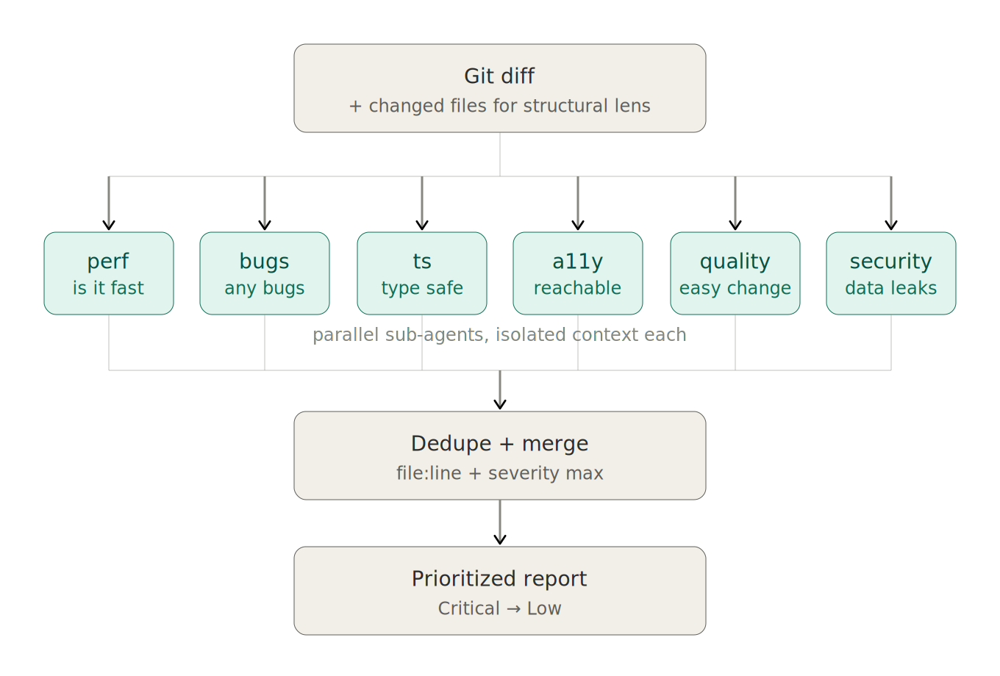

<p align="center">
  
</p>

<div align="center">

[](LICENSE)
[](#quick-start)

**6 specialized frontend guidelines, each reviewing your diff in an isolated context.**

[Quick Start](#quick-start) · [Lenses](#lenses) · [Why this design](#why-this-design) · [Architecture](#architecture) · [Adding a lens](docs/adding-a-lens.md)

English · [한국어](./README.ko.md)

</div>

A **multi-lens code-review plugin** for AI coding agents (Claude Code · Codex · Gemini CLI). It reviews a git diff or changed files from up to 6 perspectives (perf · code quality · bugs · types · a11y · security). Each perspective is a **lens**: a single-purpose reviewer with its own ruleset that runs in an isolated sub-agent context. Findings merge into one prioritized report.

The default preset follows _well-known, established frontend guidelines_ directly. Add your own lens by creating an agent file and registering it in the orchestrator's roster.

## Key Features

- **Expert lenses** — Vercel React Best Practices · Toss Frontend Fundamentals · Effective TypeScript · WCAG 2.2 · OWASP, etc.
- **Isolated per-lens context** — Each lens reviews in its own sub-agent context window. No reasoning contamination, no mode collapse.
- **Triage** — The orchestrator inspects your diff first and only runs the relevant lenses (typically 2–3 of 6). Saves time and tokens versus running all of them blindly.
- **Smart input routing** — Diff only for line-level rules, full files for structural rules. Cost stays at _"diff × N + α", not "full codebase × N"_
- **Perspective-preserving merge** — When multiple lenses catch the same code, all perspectives appear side-by-side in one issue
- **Simple setup** — Start instantly in a fresh repo with one command (Claude Code · Codex · Gemini CLI)
- **Honest about wall time** — Sub-agents run sequentially (Claude Code [Issue #3013](https://github.com/anthropics/claude-code/issues/3013); same on Codex/Gemini in practice). The value is isolation, not parallelism. See [Why this design](#why-this-design).

## Quick Start

### Install

```bash
# Claude Code (primary — plugin: orchestrator skill + 6 lens agents)
npx fe-review-skills install claude-code

# Codex CLI (review-orchestrator + 6 lens TOML agents)
npx fe-review-skills install codex-cli

# Gemini CLI (review-orchestrator + 6 lens markdown agents)
npx fe-review-skills install gemini-cli
```

Options:

- `--global` — install under `~/<tool-dir>` (use across every project)
- `--dry-run` — preview destination paths without writing

Per-tool guides: [Claude Code](docs/install-claude-code.md) · [Codex](docs/install-codex-cli.md) · [Gemini CLI](docs/install-gemini-cli.md).

### Use

After install, invoke from Claude Code via slash command or natural language:

```
/fe-review-skills:diff-review
```

Or:

```
review my staged changes
```

With options:

```
review my diff with lang=ko severity_min=high lenses=perf,a11y
```

| Option         | Default       | Values                                                                                                  |
| -------------- | ------------- | ------------------------------------------------------------------------------------------------------- |
| `scope`        | `auto`        | `auto`, `staged`, `unstaged`, `branch:<name>`, `range:<a>..<b>`                                        |
| `lang`         | `en`          | `en`, `ko`                                                                                              |
| `lenses`       | (triaged)     | comma-list (`perf` → `lens-react-perf`, `quality` → `lens-code-quality`, etc.). Setting this **disables triage** and forces these lenses |
| `severity_min` | `low`         | `critical`, `high`, `medium`, `low`                                                                     |
| `triage`       | `on`          | `on`, `off` (= run all 6 lenses without triage)                                                         |

Each lens can be invoked standalone:

```
@lens-a11y
```

Or:

```
run only lens-a11y on my unstaged changes
```

For Codex/Gemini, invoke the orchestrator agent instead of a slash command:

```
@review-orchestrator
```

## Lenses

> _lens_ = a single-purpose reviewer. The 6 in the table are the default preset; add your own freely. Agent names follow the form `lens-<name>` (e.g. `lens-a11y`).

| Lens           | Source                                                                                                           | Asks                                            | Input            | What it catches                                                                                                               |
| -------------- | ---------------------------------------------------------------------------------------------------------------- | ----------------------------------------------- | ---------------- | ----------------------------------------------------------------------------------------------------------------------------- |
| `react-perf`   | [Vercel React Best Practices](https://github.com/vercel-labs/agent-skills/tree/main/skills/react-best-practices) | Is it fast?                                     | diff             | Waterfalls, RSC serialization bloat, bundle size, rendering anti-patterns                                                     |
| `code-quality` | [Toss Frontend Fundamentals](https://github.com/toss/frontend-fundamentals)                                      | Is it easy to change?                           | **diff + files** | Readability, predictability, cohesion, coupling                                                                               |
| `bugs`         | React rules-of-hooks + ESLint/TS-ESLint + JS/TS/HTML/CSS correctness rules                                       | Are there bugs?                                 | diff             | Stale closures, missing deps, hook order, race conditions, floating promises, empty catches, == coercion, missing button type |
| `ts`           | Google TypeScript Style Guide + Effective TypeScript                                                             | Is the type system being worked with or around? | diff             | `any`, careless casts, `!` assertions, `@ts-ignore`, weak types, mutable exports                                              |
| `a11y`         | WCAG 2.2 + ARIA APG                                                                                              | Can everyone reach it?                          | diff             | Missing alt, unnamed icon buttons, broken keyboard nav, ARIA misuse, focus indicator removal                                  |
| `security`     | OWASP + frontend-specific                                                                                        | Is data leaking?                                | diff             | XSS, secret leakage, unsafe storage, dangerous JS APIs                                                                        |

## Why this design

### Why isn't one perspective enough?

Each guideline answers a _different question_ — perf asks _is it fast_, a11y asks _can everyone reach it_, security asks _is data leaking_. The perspectives barely overlap, so running just one will entirely miss the issues the others would catch. It's like taking the multiple viewpoints a senior reviewer simultaneously juggles in their head when looking at a PR, and lifting them directly into a tool.

### Why isolated sub-agents (instead of one model with one prompt)?

Telling one model "review this PR for perf, quality, a11y, security, types, and bugs at the same time" produces lower-quality output than dispatching each as a sub-agent with its own context. Two structural reasons:

1. **No reasoning contamination** — In a single context, the perf finding's framing colors the a11y finding's tone. Split into sub-agents, each lens does its job _without knowing_ what the others caught.
2. **No mode collapse** — One context "review for everything" tends to gravitate toward whichever axis is loudest in the diff. Physically separate contexts make that impossible.

By analogy: instead of asking one person to "review it from every angle," it's **a panel of specialist reviewers placed in isolated rooms with the same change in hand, gathered afterward to reconcile conflicts and overlap**.

### Why we don't promise parallel execution

The temptation is real: every multi-agent kit advertises "parallel sub-agents." We did too in early versions, then we measured. **Claude Code's runtime serializes sub-agent dispatch** even when the orchestrator emits multiple Task tool blocks in one message — see [Issue #3013](https://github.com/anthropics/claude-code/issues/3013) (closed-not-planned). NeoLab's `do-in-parallel` skill (2208 lines of "CRITICAL: parallel" prompting) hits the same wall. Codex and Gemini behave the same in practice, despite documentation claims. Sub-agent dispatch is structurally serial today.

We don't fight it. We use **triage** instead: the orchestrator looks at your diff first and only dispatches the lenses that are likely relevant. A typical run hits 2–3 lenses out of 6, taking ~1–1.5 min instead of ~3 min. You can disable triage with `triage=off` to force all 6.

If `Issue #3013` ever flips and parallel dispatch becomes real, you'll get the speedup automatically — the architecture is ready for it.

### Why doesn't cost scale at N×?

We don't burn tokens in proportion to lens count — each lens has a different _unit of judgment_, so the input differs too. The 5 lenses checking line- or function-level rules (bugs / a11y / security / perf / ts) get **only the diff**, while just one — `lens-code-quality`, which checks structural rules like cohesion and coupling — additionally gets the **full content of changed files**.

**Since 5 of 6 lenses only see the diff, total token usage stays bounded** — the real cost is _"diff × N + α", not "full codebase × N"_. With triage active, that becomes _"diff × triaged-N + α"_, lower still. What that cost buys — _consistent coverage from multiple perspectives_ — is something _no single-model pass can structurally achieve, no matter how the prompt is written_. That's this project's bet.

## Architecture

<p align="center">
  
</p>

## How findings merge

Each lens returns a JSON array of findings:

```json
{
  "file": "src/components/Header.tsx",
  "line_start": 23,
  "line_end": 41,
  "severity": "high",
  "category": "server-fetch-in-effect",
  "title": "useEffect for data fetching",
  "rationale": "Initial data is fetched on the client, causing waterfall and bundle cost.",
  "suggestion": "Move to a Server Component and pass via props"
}
```

Merging groups findings by `file` + overlapping line ranges. When multiple lenses fire on the same code at once, the merged issue preserves all perspectives — for example, a `useEffect` that fetches data can be caught simultaneously in three places: `lens-react-perf` (waterfall), `lens-code-quality` (hidden side effect), and `lens-bugs` (setState race after unmount). The reviewer sees one issue with three perspectives, not three duplicate alerts.

Final severity is the max across perspectives. Sort: severity descending → file path → line number.

## Sample output

A single change can fire multiple lenses on the same lines. Here's a hunk that hits three:

```diff
+ export default function Profile({ userId }) {
+   const [bio, setBio] = useState('');
+
+   useEffect(() => {
+     fetch('/api/user/' + userId, {
+       headers: { 'X-API-Key': 'sk_live_<YOUR_KEY>' },
+     })
+       .then(r => r.json())
+       .then(d => setBio(d.bio));
+   }, []);
+
+   return <div dangerouslySetInnerHTML={{ __html: bio }} />;
+ }
```

`/fe-review-skills:diff-review` returns a single prioritized report. Findings on overlapping lines merge into one issue with each lens's view preserved:

---

#### Code Review

> **staged** · 1 file · 2 issues · 🔴 1 · 🟠 1
> Lenses: bugs, react-perf, security · 3 triaged out

##### 🔴 Critical

###### 1. Client useEffect fetch with hardcoded API key

`src/components/Profile.tsx:4-10` · 3 perspectives

- **security** — Live-key pattern (`sk_live_*`) committed in source. Push protection assumes the key is already revoked.
  → Move to a server-side env var; never ship to the client bundle.
- **react-perf** — Client `useEffect` fetch creates a render → fetch → render waterfall.
  → Hoist to a Server Component and pass `bio` via props.
- **bugs** — `userId` is in the URL but missing from the deps array — stale when the prop changes.
  → Add `userId` to the deps (and address the perf issue first).

##### 🟠 High

###### 2. Network HTML rendered via dangerouslySetInnerHTML

`src/components/Profile.tsx:11`

- **security** — HTML from a network response rendered raw. XSS if `/api/user` is ever influenced by user input.
  → Sanitize server-side or render as text.

---

One pass, three angles on the same line range. The lenses don't see each other — the merge happens after they return.

## Adding a lens

If the default 6 don't cover a perspective you need (i18n, motion, dependency hygiene, design tokens, etc.), drop in `agents/lens-<name>.md` then register it in the orchestrator's roster (one row in the lens table, one row in the triage table). No `package.json` changes needed.

Full guide: [docs/adding-a-lens.md](docs/adding-a-lens.md) — frontmatter contract, finding JSON schema, rule-catalog format, boundary discipline (don't overlap with other lenses), and a copy-paste-ready agent skeleton.

## Inspiration

This project is inspired by the Compounding Engineering pattern Toss uses internally (multiple LLMs reviewing a PR with isolated contexts).

## License

MIT — see [LICENSE](./LICENSE).
